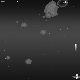
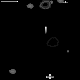
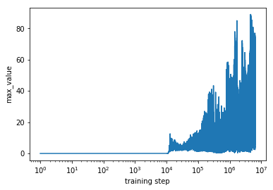
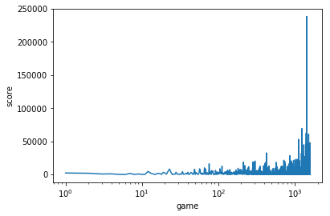

# SpaceShooter in DQN


## Overview

This work is based on the game [SpaceShooter](https://github.com/tasdikrahman/spaceShooter)

I do these things on it:
* **wrap the game for training**
* **test DQN algorithm on it**

## Installation Dependencies:
* Python3
* TensorFlow >= 1.1.0
* tflearn
* pygame
* OpenCV-Python

## How to Install
* my system is win10, linux/mac is a little defferent but easier
```
pip install tensorflow
pip install tflearn
pip install opencv-python
```
&nbsp;&nbsp;pygame click here:　 [PyGame](https://blog.csdn.net/qq_33166080/article/details/68928563)</br>
&nbsp;&nbsp;tensorflow gpu click here:　[Windows10 64位下安装TensorFlow - 官方原生GPU版安装](https://blog.csdn.net/goodshot/article/details/61926838)

## How to Run
* Test the model
```
python main.py
```
* Continue training
```
python main.py --train True
```
* Play the game by yourself
```
python main.py --human_play True
```
* Human Controls

|              | Button              |
|--------------|---------------------|
| Move Left    | <kbd>left</kbd>     |
| Move right   | <kbd>right</kbd>    |
| Fire bullets | <kbd>spacebar</kbd> |
| Quit game    | <kbd>Esc</kbd>      |

## DQN Algorithm
This algorithm is on paper [Human-level control through deep reinforcement learning ](https://www.ncbi.nlm.nih.gov/pubmed/25719670)
 <br>
 
## Details
 * The DQN code is nearly the same with [FlappyBird_DQN_with_target_network](https://github.com/initial-h/FlappyBird_DQN_with_target_network)
 * When train,you can wipe off the background or not
 
 * The algorithm is not very effective given the game is so easy.And its performance is very unstable. 
